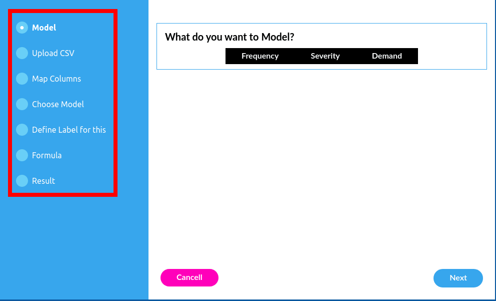
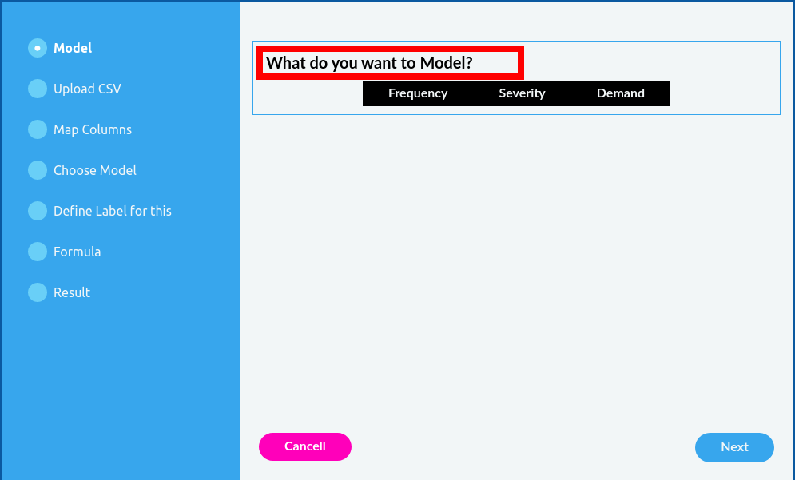
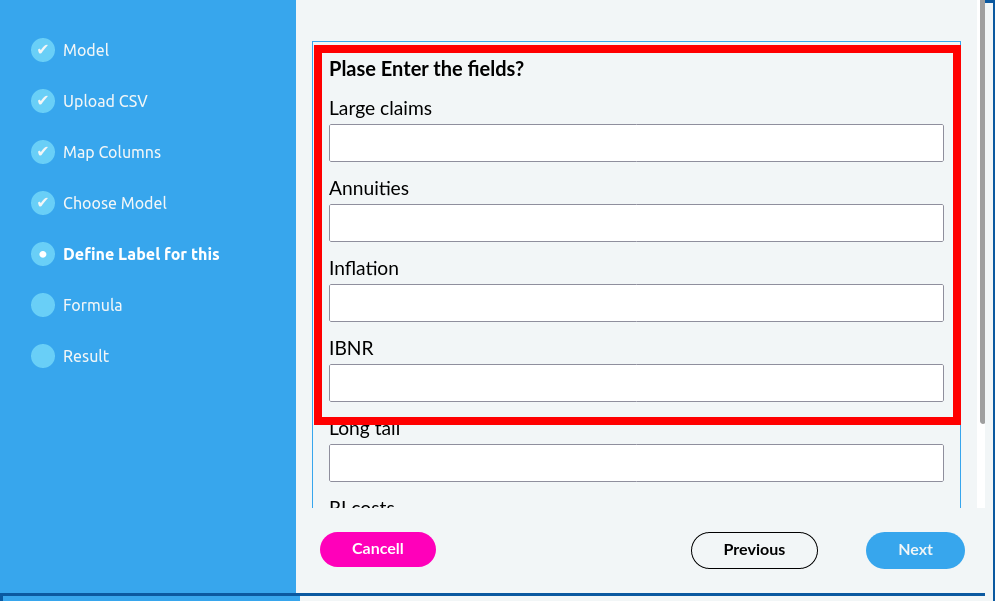
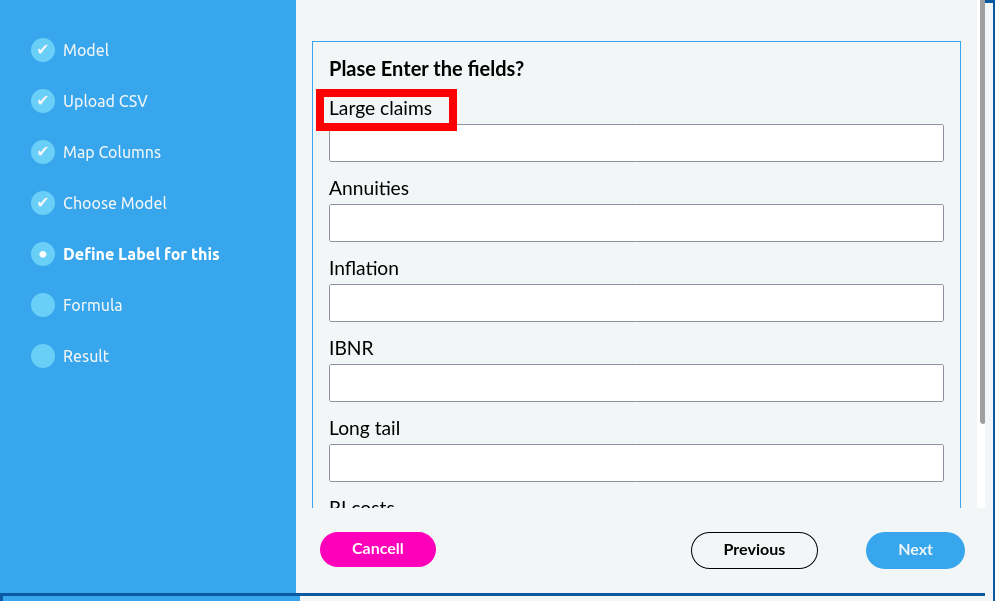
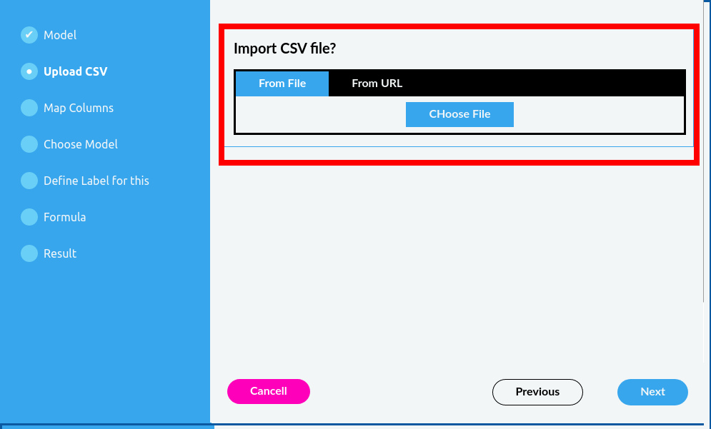

# How to create the form configuration

The form configuration object has a 2 fields
- **`title`** : *this is currently not being used, so you can ignore this field.*
- **`steps`** this is an array of steps configuration
  

 ## The `steps` array

 This field contains array of steps, each step is rendered as a separate wizard step.

 Example :
 
        
        steps : [
            {
                label : "Step Label",
                questions : [ array ]
            },
            {
                label : "Step Label",
                questions : [ array ]
            },
            
        ]

  - **`label`**  Is a string that will be used to indicate the step in the navigation.
    
    

  - **`questions`**  Is an array of questions that the step will render. One step can render multiple questions.
  - 

### Question 

This object defines the question that the step will render. Differnt types of question can have different fields  but the following are the common fields among each question type. 
  - **`type`** the type of the question, it could be one of the following
    - `file`
    - `text`
    - `radio` 
    - `column_mapper`
    - `result`
    - `formula`
  
  - **`name`**  the name used in the html input, all question types does not support this. the following question types **DOES NOT** support the **`name`** attribute.
    - `column_mapper`
    - `formula`
    - `result`
  - **`description`** A string value that is used to descripbe about the question.
  
    

        
  

### Question Types in Detail

#### Radio Button
Radio button type questions are the one that produce inputs that look like the following. user select only one of the options. 

Here is a sample radio button form config.

                {
                    type: "radio",
                    description: "What do you want to Model?",
                    name: "model",
                    options: [
                        {
                            label: "Frequency",
                            value: "f"
                        },
                        {
                            label: "Severity",
                            value: "s"
                        },
                        {
                            label: "Demand",
                            value: "d"
                        }
                    ]
                }

Beside the common fields that all question types support, radio button question require additional attributes.

- **`options`** Is an array of availbel radio buttons
  - **`label`** Is the label of the radio button
  - **`value`** Is the value of the radio button

The above code is equivalent to the following html output

    

        <input name="model" type="radio" value="f">
        <label>Frequency</label>
    

    

        <input name="model" type="radio" value="f">
        <label>Frequency</label>
    

    

        <input name="model" type="radio" value="d">
        <label>Demand</label>
    

#### Free Text Input
Free Text Input type questions are the one that produce inputs that look like the following. user can freely enter text values. as you may can see it on the screenshot  , there are multiple input/label for one question description.

Here is a sample free text form config.

                {
                    type: "text",
                    name: "model2",
                    description: "Plase Enter the fields?",
                    inputs: [
                        {
                            name: "large_claims",
                            label: "Large claims",
                            default : "this is default value"
                        },

                        {
                            name: "annuities",
                            label: "Annuities",
                        },

                        {
                            name: "inflation",
                            label: "Inflation",
                        },
                        {
                            name: "ibnr",
                            label: "IBNR",
                        },
                        {
                            name: "long_tail",
                            label: "Long tail",
                        },
                        {
                            name: "ri_costs",
                            label: "RI costs",
                        }

                    ]
                }

Beside the common fields that all question types support, a free text input question  require additional attributes, those are

- **`inputs`** array of input objects
  - ***`name`***  : the name of the html input.
  - ***`default`***  : The default value of the input element.
  - ***`label`***  : the string  to be used as the label of the  html input.

    

#### CSV file importer

CSV file importer lets you import from local computer or using a url. 

Beside the common fields that all question types support, a CSV file importer  question  requires additional attributes, those are : 

-  **`name`** the name by which the imported file will be reffered t later, specially by collumn mapper

#### Creating a Column Mapper

Column mapper maps column from the imported CSV file  to those specified in the config.

Beside the common fields that all question types support, a column mapper question  requires additional attributes, those are : 

-  **`columns`** Array of column to which the imported CSV file columns are mapped
-  **`file`** The name of the file from which the CSV columns are mapped.
  

